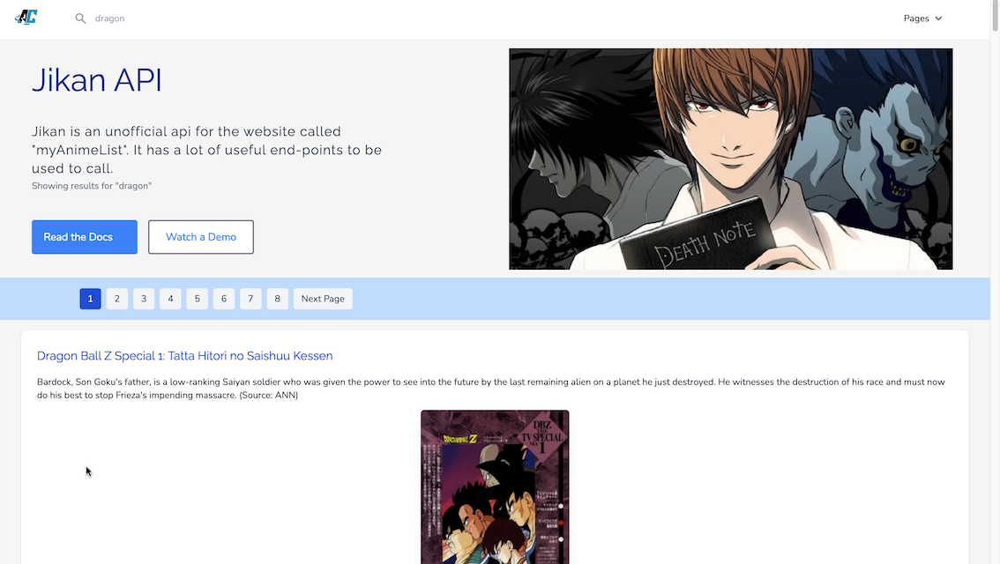
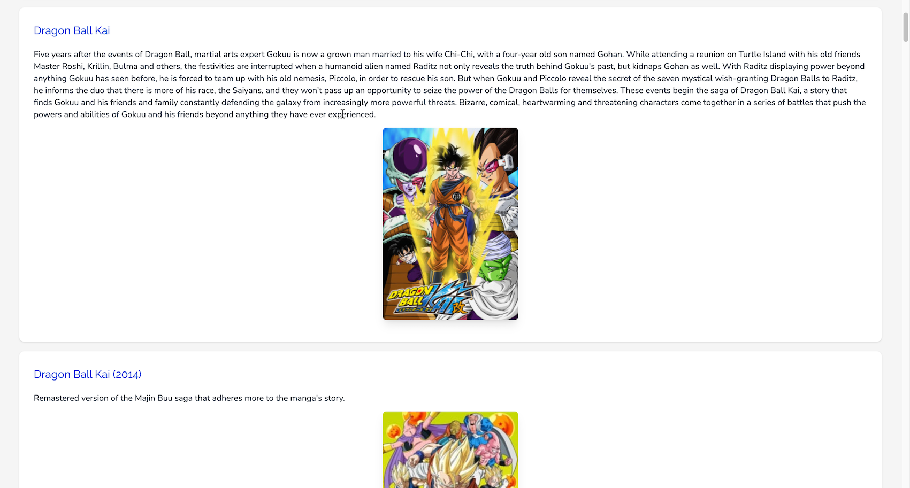

# Anime Dashboard - Vue, Vite + Tailwind

**Anime Dashboard is an application to get anime related info using the unofficial [MyAnimeList](https://myanimelist.net/) API. Please visit the Jikan unofficial API link [Jikan](https://jikan.moe/).**

<p align="center"><a href="https://vuejs.org" target="_blank" rel="noopener noreferrer"></a></p>

## Technologies Used

A front-end app created in Vue using Tailwind css and Headless UI


## Getting started

The project uses Vite build tool for lighting-fast modern single-page application development. It is expected to have Node installed on your system. Then, run the conventional npm commands to see the project in action.

```
npm install
npm run build
npm run dev
```

## Recommended IDE Setup

- [VS Code](https://code.visualstudio.com/) + [Vue - Official](https://marketplace.visualstudio.com/items?itemName=Vue.volar) (previously Volar) and disable Vetur

## Ecosystem

| Package        | Purpose                |
| -------------- | ---------------------- |
| Vue-router     | For routing in Vue     |
| Pinia          | For Vue store          |
| Tailwind CSS   | For CSS Styles         |
| Headless icons | For icons to be used   |
| Express        | Serving Vue build      |
| Vee-validate   | For validations        |
| Headless UI    | For dynamic components |

## Project Screenshots

Only contains home page with features like searching for an anime and gets the data in paginated form.



Pagination is available with the API response, 25 items are fetched at max in one go.



## Checking Updates

Check if there are updates available for NPM packages used in this project.

---

```
npx npm-check-updates

npx npm-check-updates -u

npm i
```

## Issues

No issues as of now, issues would be added here to be addressed later.

## Changelog

- April 2024 : Initial Release with basic features from anime search page.

## Stay In Touch

- [Twitter](https://twitter.com/vuejs)
- [Blog](https://medium.com/the-vue-point)
- [Job Board](https://vuejobs.com/?ref=vuejs)

## License

[MIT](https://opensource.org/licenses/MIT)

Copyright (c) 2024-present, Amit Prafulla (Apfirebolt)